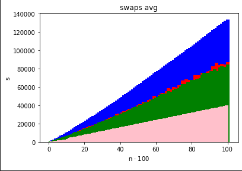
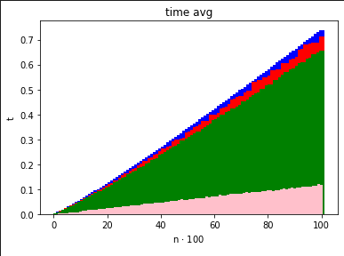

# Lista-3

## Zadanie 1

> Uzupełnij [zadanie 2 z listy 2](../lista-2/readme.md#zadanie-2) o algorytm RADIX SORT. Porównaj wcześniej zaimplementowane algorytmy z RADIX SORTEM pod względem liczby wykonanych operacji, czasu działania algorytmu oraz zużycia pamięci (wykorzystaj np. `sysinfo` lub `GetProcessMemoryInfo`), dla danych o rozmiarze $n\in \{ 10,50,100,500,1000,5000,\dots,100000 \}$, sprawdź jak na działanie RADIX SORTa wpływa zakres, z którego losowane są dane do sortowania.

*Jako, że jest to zadanie rozszerzające, praktycznie rzecz biorąc, całą poprzednią listę folder na zadanie 1 ma w sobie kopię całej listy 2 rozszerzonej o zadanie 1 z listy 3.*\
*Dlatego też nazwy takie jak `ex-1` czy też `ex-2` odwołują się do odpowiednich zadań z listy 2. Mowa tutaj oczywiście tylko o plikach w folderze na zadanie 1.*

W celu kompilacji programu należy użyć `make`. *(Możliwe jest uprzednie posprzątanie `make clean`)*\
Żeby uruchomić program należy użyć `./main.out <params>`, gdzie `<params>`:

- `--type` - uruchom program z algorytmem:
  - `quick` dla `QuickSort` *(domyślny)*
  - `insert` dla `InsertSort`
  - `merge` dla `MergeSort`
  - `dual-pivot-quick` dla `DualPivotQuickSort`
  - `radix` dla `RadixSort`
- `--comp` - kolejność elementów:
  - `'>='` malejąca
  - `'<='` rosnąca *(domyślna)*
- `--stat nazwa_pliku k`
  - `nazwa_pliku` plik do którego program ma zapisać statystyki
  - `k` ile razy ma wykonać pętlę opisaną w [zadaniu 2 listy 2](https://cs.pwr.edu.pl/golebiewski/teaching/1920/aisd/lab2.pdf)

### Czas i liczba przestawień

Poniższe wykresy pokazują, że w przypadku sortowania liczb `RadixSort` radzi sobie najlepiej w porównaniu z poprzednio zaimplementowanymi algorytmami.

**Liczba przestawień**\


**Czas**\


**Liczba przestawień nad `n`**\


gdzie:
- kolor czerwony -> `QuickSort`
- kolor zielony -> `DualPivotQuickSort`
- kolor niebieski -> `MergeSort`
- kolor różowy -> `RadixSort`

### Zużycie pamięci

Do zmierzenia ilości zużywanej pamięci wykorzystywałem programu `ps -p <PID> -o vsz` w celu odczytania ilości wykorzystywanej pamięci wirtualnej.\
Zmodyfikowałem program z listy 2 w ten sposób, żeby po jego uruchomieniu z parametrem `--stat` wyświetlał na samym początku działania swoje `PID`.

Program uruchamiałem z parametrem `k = 10` poszczególne algorytmy i śledziłem zużycie pamięci procesów.

Algorytm `RadixSort` na końcu działania zużywał aż `111 772 kB` wirtualnej pamięci (parametr VSZ).\
Za to `QuickSort` zużywał jedynie `33 716 kB` wirtualnej pamięci. Podobnie zachowywał się `DualPivotQuickSort` oraz `InsertionSort`.

Co ciekawe, zużycie pamięci w przypadku `MergeSort` rosło bardzo szybko przekraczając zużycie pamięci `RadixSort`a. Domyślam się jednak, że to wynika ze słabego działania *garbage collector*'a a nie z samego algorytmu.

Oczywiście w przypadku pamięci wchodzi też tutaj *overhead* w postaci innych komponentów programu, bo program nie składa się tylko z samego czystego algorytmu.\
Jednakże różnica jest jak najbardziej zauważalna - po wyjściu z *comparison model* uzyskujemy sortowanie w czasie liniowym, jednak tracimy na wielkości potrzebnej pamięci.

### Wpływ zakresu

Przy zmniejszeniu zakresu, z którego są losowane liczby do sortowania następuje nawet dwukrotne zmniejszenie się liczby przestawień oraz znacznie krótszy czas działania. Dzieje się tak nawet przy ciągach bardzo dużych rozmiarów.

---

## Zadanie 2

> Zaimplementuj podane na wykładzie algorytmy: RANDOMIZED SELECT, SELECT. Program przyjmuje jeden z dwóch parametrów wejściowych:
> - wywołanie `./main -r` oznacza operowanie na danych losowych długości $n$
> - wywołanie `./main -p` oznacza operowanie na losowej permutacji zbioru $\{1,2,\dots,n\}$.
> Po uruchomieniu, program wczytuje ze standardowego wejścia dwie liczby całkowite: $n$ – długość danych oraz $1\le k \le n$ – numeru szukanej statystyki pozycyjnej, a następnie generuje tablicę danych (zależnie od parametru uruchomienia) i sekwencyjnie uruchamia zaimplementowane algorytmy na wygenerowanych danych. W czasie wykonywania algorytmów SELECT, RANDOMIZED SELECT, na standardowym wyjściu błędów, powinien być wypisywany log, tak by można było działanie algorytmu odtworzyć. W szczególności powinien zawierać on tablicę danych, $k$, kolejno wybierane pivoty, wykonywane porównania i przestawienia oraz podsumowanie zawierające liczbę porównań oraz przestawień elementów (**Uwaga:** w przypadkach, gdy nie jest to niezbędne dla znalezienia $k$-tej statystyki pozycyjnej, nie powinno następować sortowanie całej tablicy).
>
> Wynikiem, wyświetlanym na standardowym wyjściu, działania algorytmu jest tablica z zaznaczoną $k$-tą statystyką pozycyjną.
>
> Przykładowe wywołanie:
> ```
> ./main -p
> 7
> 3
> 2 1 [3] 5 4 6 7
> ```
>
> Wykonaj testy, powtarzając wywołania algorytmów dla tych samych danych wejściowych, by wyciągnąć wnioski na temat minimalnej i maksymalnej liczby porównań dla obu algorytmów, policz również średnią i odchylenie standardowe dla zebranych statystyk.
>

W celu ułatwienia korzystania z programu algorytmy nie są uruchamiane jeden po drugim, a raczej na podstawie argumentów `--select` oraz `--randomized-select`.

W celu uruchomienia programu należy wykonać `make` oraz `./main.out <-p|-r> <--select|--randomized-select>`.\
Następnie należy podać liczby $n$ oraz $k$ oddzielone spacją lub nową linijką.

### Zadanie 2 - statystyki

Do skompilowania poniższych statystyk uruchamiałem program na danych $n = 128$, $k = 32$ przy uruchamianiu programu z parametrem `-p`.

**Liczba porównań:**
|                      . | SELECT | RANDOMIZED SELECT |
| ---------------------: | :----: | :---------------: |
|                Maximum |  840   |        606        |
|                Minimum |  636   |        189        |
|                Średnia | 751.8  |        380        |
| Odchylenie standardowe | 70.153 |      147.742      |

---

## Zadanie 3

> Zaimplementuj rekurencyjny algorytm wyszukiwania binarnego. Program na wejściu otrzymuje posortowaną tablicę długości $n$ oraz wartość $v$, i zwraca $1$ w przypadku istnienia elementu $v$ w tablicy lub $0$ w przeciwnym przypadku. Przetestuj działanie Master theorem dla zliczonej w trakcie działania algorytmu liczby porównań elementów oraz czasu wykonania. Test powtórz dla $n \in \{ 1000,2000,\dots,100000 \}$ i na ich podstawie oszacuj czynnik $O(1)$ dla obu statystyk.

W celu uruchomieniu programu należy użyć `./main.py`.

Program zwraca wynik testu opisany [w zadaniu](https://cs.pwr.edu.pl/golebiewski/teaching/1920/aisd/lab3.pdf).
