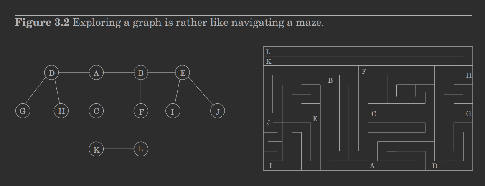

# Depth First Search (DFS)
*Przeszukiwanie w głąb*

DFS grafu nieskierowanego – procedura pozwalająca na eksplorację wszystkich wierzchołków grafu. DFS pozwala odpowiedzieć na pytanie do których wierzchołków grafu można dojść startując z zadanego wierzchołka.

## `explore`$(G,v)$

Reprezentujemy graf przy pomocy [listy sąsiedztwa](def-grafy.md#lista-s%c4%85siedztwa). Reprezentacja ta pozwala tylko na znajdowanie sąsiadów wierzchołków grafów. Przyjrzyjmy się procedurze `explore`$(G,v)$, która pozwala znaleźć wszystkie wierzchołki grafu $G = (V,E)$ dostępne z wierzchołka $v \in V$.

`explore`$(G,v)$:
1. $\mathrm{visited}(v) = \mathrm{True}$
2. `previsit`$(v)$
3. `for each` $\{v,u\} \in E$:
   1. `if not` $\mathrm{visited}(u)$:
      1. `explore`$(u)$
4. `postvisit`$(v)$

Procedur `previsit` oraz `postvisit` są opcjonalne i pozwalają na wykonanie operacji w momencie odpowiednio pierwszego odwiedzenia wierzchołka i opuszczenia wierzchołka.

`visited` jest flagą, która zostanie ustawiona na `true` dla wszystkich wierzchołków do których można dojść z wierzchołka startowego.

Szkic dowodu poprawności procedury `explore`$(G,v)$ można wykonać nie wprost:
- załóżmy, że istnieje wierzchołek $u$, do którego można dotrzeć z wierzchołka startowego $v$, ale jego flaga `visited`$(u)$ nie została ustawiona na `true`
- znajdźmy ostatni wierzchołek $z$ na ścieżce od $v$ do $u$, dla którego procedura `explore`$(G,v)$ ustawiła flagę `visited`$(z)$ na `true`
- niech $w$ będzie wierzchołkiem na ścieżce od $v$ do $u$, który znajduje się na tej ścieżce bezpośrednio po wierzchołku $z$.
- Zatem: $w$ musi być sąsiadem $z$ oraz $z$ był odwiedzony a $w$ nie. Doprowadza to do sprzeczności, bo jeśli procedura `explore` była w wierzchołku $z$ to powinna przejść do wierzchołka $w$.

Przykład `explore`:

## `DFS`$(G)$

1. `for all` $v \in V$:
   1. `visited`$(v) = \mathrm{False}$
2. `for all` $v \in V$:
   1. `if not` `visited`$(v)$:
      1. `explore`$(v)$

Złożoność obliczeniowa:
- zakładamy, że `previsit` oraz `postvisit` mamy $O(1)$
- pętla po wszystkich sąsiadach wierzchołka w celu sprawdzenia czy można dotrzeć do jakiegoś jeszcze nie odwiedzonego wierzchołka

Pierwszy krok (pętla) sumarycznie dla całego grafu $G$ będzie miał złożoność $O(|V|)$. Drugi krok w każdym wierzchołku ma złożoność obliczeniową zależną od stopnia tego wierzchołka.\
Jeśli spojrzymy na to z perspektywy całego grafu to widzimy, że drugi krok przechodzi po każdej krawędzi w grafie dwa razy (dla $\{u,v\} \in E$ raz dla `explore`$(u)$, drugi raz dla `explore`$(v)$).

Zatem złożoność drugiego kroku w całym grafie to $O(|E|)$. W sumie złożoność obliczeniowa DFS wynosi $O(|V| + |E|)$, czyli liniowo w stosunku do wielkości grafu.

## Zastosowanie - spójność grafu

Dodajemy do każdego wierzchołka parametr `component_number`, zainicjować zmienną `cc = 0` na początku procedury DFS, zdefiniować procedurę

`previsit`$(v)$:
1. $v.$`component_number = cc`

oraz zwiększać zmienną `cc` o $1$ za każdym razem gdy w procedurze DFS jest procedura `explore`. Po wykonaniu tak zmodyfikowanego DFSa w zmiennych `component_number` każdego wierzchołka mamy zapisane, do której komponent należy dany wierzchołek, a zmienna `cc` zawiera liczbę komponent.

## More

- [Chapter 3](http://algorithmics.lsi.upc.edu/docs/Dasgupta-Papadimitriou-Vazirani.pdf)
- [Chapter 22](https://web.ist.utl.pt/~fabio.ferreira/material/asa/clrs.pdf)
