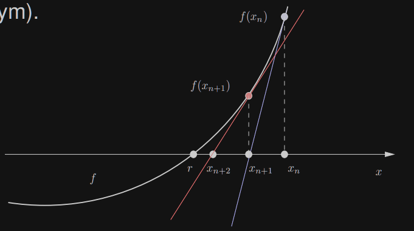

# Metoda Newtona

*(2020-10-20)*

- [1. Metoda Newtona (metoda stycznych)](#1-metoda-newtona-metoda-stycznych)
- [2. Algorytm](#2-algorytm)
- [3. Twierdzenie o lokalnej zbieżności metody Newtona](#3-twierdzenie-o-lokalnej-zbieżności-metody-newtona)
    - [3.1. D-d](#31-d-d)
        - [3.1.1. Wykładnik zbieżności](#311-wykładnik-zbieżności)
        - [3.1.2. Zbieżność](#312-zbieżność)
    - [3.2. Przykład](#32-przykład)
- [4. Twierdzenie#3](#4-twierdzenie3)

---

## 1. Metoda Newtona (metoda stycznych)

Założenia:
- $f \in C^2[a,b]$
- $f'(r) \neq 0$ ($r$ jest pierwiastkiem jednokrotnym)

- $f(x) = f(x_n) + f'(x_n) \cdot (x - x_n) + \mathcal{O}((x - x_n)^2) \qquad$ szereg Taylora
- $f(x) \approx f(x_n) + f'(x_n)(x - x_n) \qquad$ linearyzacja
- $x_{n+1} = x_n - \frac{f(x_n)}{f'(x_n)} = x_n + h_n \enspace (n\ge 0) \qquad x_0$ jest dane ($h_n$ to jest poprawka)

Warunek końca: $|x_{n+1} - x_n| \le \delta, \enspace |f(x_{n+1})| \le \epsilon$.

## 2. Algorytm

- *Dane: $x_0, M, \delta, \epsilon$*
- *Wyniki: $k, \tilde{r}, f(\tilde{r})$*

1. $v \gets f(x_0)$
2. `if` $|v| < \epsilon$:
    1. `return` $0, x_0, v$
3. `for` $k \gets 1$ `to` $M$:
    1. $x_1 \gets x_0 - \frac{v}{f'(x_0)}$
    2. $v \gets f(x_1)$
    3. `if` $|x_1 - x_0| < \delta$ `or` $|v| < \epsilon$:
        1. `return` $k, x_1, v$
    4. $x_0 \gets x_1$

Powyższy algorytm korzysta z funkcji liczących $f(x)$ oraz $f'(x)$.

---

## 3. Twierdzenie o lokalnej zbieżności metody Newtona

Niech $f \in C^2[a,b]$ oraz $r$ będzie jednokrotnym pierwiastkiem $f$.\
Wówczas istnieje otoczenie $r$ i stała $C$ i jeśli przybliżenie początkowe $x_0$ należy do otoczenia $r$, to ciąg konstruowanych przez metodę Newtona przybliżeń $\{ x_n \}$ spełnia
$$
|x_{n+1} - r| \le C\cdot (x_n - r)^2.
$$

Ponadto $\lim_{n \to \infty} x_n = r$.

### 3.1. D-d

#### 3.1.1. Wykładnik zbieżności

Przez błąd rozumiemy wielkość $e_n = x_n - r$.
$$
e_{n+1} = x_{n+1} - r = x_n - \frac{f(x_n)}{f'(x_n)} - r = e_n - \frac{f(x_n)}{f'(x_n)} = \frac{e_n \cdot f'(x_n) - f(x_n)}{f'(x_n)}.
$$

Rozwijamy $f$ w szereg Taylora w otoczeniu $x_n$:
$$
f(r) = f(x_n) + f'(x_n) \cdot (r-x_n) + \frac{1}{2} f''(\zeta_n) \cdot (r - x_n)^2 =\\
= f(x_n) - f'(x_n) e_n + \frac{1}{2} f''(\zeta_n) \cdot e_n^2
$$
gdzie $\zeta_n$ jest liczbą leżącą między $r$ oraz $x_n$.

$$
0 = f(r) = f(x_n) - f'(x_n) \cdot e_n + \frac{1}{2} \cdot f''(\zeta_n) \cdot e_n^2
$$

Przekształcając powyższe równanie otrzymujemy
$$
f'(x_n) \cdot e_n - f(x_n) = \frac{1}{2} \cdot f''(\zeta_n) \cdot e_n^2
$$

$$
e_{n+1} = \frac{e_n \cdot f'(x_n) - f(x_n)}{f'(x_n)} = \frac{1}{2} \frac{f''(\zeta_n)}{f'(x_n)} \cdot e_n^2 \approx\\
\approx \frac{1}{2} \frac{f''(r)}{f'(r)} \cdot e_n^2 = C\cdot e_n^2
$$
(zakładamy, że $x_n \to r$)

#### 3.1.2. Zbieżność
Zdefiniujmy $c(\delta)$:
$$
c(\delta) = \frac{1}{2} \frac{\max_{|x-r| \le \delta} |f''(x)|}{\min_{|x-r| \le \delta} |f'(x)|} \quad (\delta > 0)
$$

Wybierzmy $\delta$ (zmniejszając wartość), takie, że $\delta \cdot c(\delta) < 1$. Można to zrobić, ponieważ jak $\delta \to 0,\enspace c(\delta) \to \frac{1}{2} \frac{|f''(r)|}{|f'(r)|}$, to $\delta \cdot c(\delta) \to 0$.\
Ustalmy $\delta$ i połóżmy $\rho = \delta \cdot c(\delta)$. Załóżmy, że $x_0$ jest punktem startowym metody Newtona spełniającym $|x_0 - r| \le \delta$.\
Wówczas $|e_0| \le \delta$ oraz $|\zeta_0 - r| \le \delta$.\
Stąd
$$
\frac{1}{2} \left| \frac{f''(\zeta_0)}{f'(x_0)} \right| \le c(\delta).
$$

Pokażemy, że kolejne przybliżenie $x_1$ leży w otoczeniu $r$.
$$
|x_1 - r| = |e_1| \le e_0^2 \cdot c(\delta) = |e_0|\cdot |e_0| \cdot c(\delta) \le |e_0| \delta\cdot c(\delta) = |e_0| \rho < |e_0| \le \delta
$$

Stąd mamy $|e_1| \le \rho|e_0|.$\
Uogólniając
$$
|e_n| \le \rho|e_{n-1}| \le \rho^2 |e_{n-2}| \le \dotsb \le \rho^n |e_0|.
$$

Z faktu, że $\rho < 1$ wynika $\lim_{n\to \infty} \rho^n = 0$, w konsekwencji $\lim_{n \to \infty} e_n = 0$.
$\blacksquare$

---

### 3.2. Przykład

$f(x) = \left( \frac{x}{2} \right)^2 + \sin x$

*Wyznaczyć metodą Newtona miejsce zerowe funkcji $f$ w przedziale $[1.5; 2]$ z dokładnością $\delta = 0.5_{10}$ a $x_0 = 1.5$.*

| $n$ | $x_n$      | $h_n$        | $\lvert x_n - r \rvert$ |
| --- | ---------- | ------------ | ----------------------- |
| $0$ | $1.5$      | $0.6439$     | $-0.43374$              |
| $1$ | $2.14039$  | $-0.18838$   | $0.26644$               |
| $2$ | $1.95201$  | $-0.018808$  | $0.0111825$             |
| $3$ | $1.93393$  | $-0.00018$   | $0.00018$               |
| $4$ | $1.933375$ | $< 5_10 - 6$ | $< 5_10 - 6$            |

Metoda bisekcji wykonała $17$ iteracji dla $a = 1.5$ oraz $b = 2$.

---

## 4. Twierdzenie#3
Niech $[a;b]$ będzie przedziałem takim, że:
- $f(a)$ oraz $f(b)$ mają przeciwne znaki
- $f''(x)$ jest ciągła i zmienia znaku na $[a;b]$
- styczne do krzywej $f(x)$ poprowadzone w punktach o odciętych $a$ oraz $b$ przecinają $\mathrm{OX}$ wewnątrz przedziału $[a;b]$

Wówczas $f$ ma dokładnie jedno zero w $[a;b]$ i metoda Newtona jest zbieżna do $r$ dla dowolnego punktu startowego $x_0 \in [a;b]$.

---
