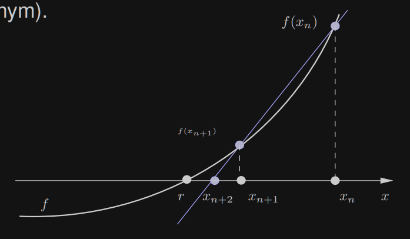

# Metoda siecznych

*(2020-10-20)*

- [Metoda siecznych](#metoda-siecznych)
- [Algorytm](#algorytm)
- [Twierdzenie o lokalnej zbieżności metody siecznych](#twierdzenie-o-lokalnej-zbieżności-metody-siecznych)
    - [D-d](#d-d)
        - [Wykładnik zbieżności](#wykładnik-zbieżności)
        - [Zbieżność](#zbieżność)

---

## Metoda siecznych

Założenia:
- $f \in C^2 [a;b]$
- $f'(r) \neq 0$ ($r$ jest pierwiastkiem jednokrotnym)

Aproksymujemy $f'(x_n) \approx \frac{f(x_n) - f(x_{n-1})}{x_n - x_{n-1}}$.

$$
x_{n+1} = x_n - \frac{x_n - x_{n-1}}{f(x_n) - f(x_{n-1})} \cdot f(x_n) = x_n + h_n
$$
gdzie:
- $n \ge 1$
- $x_0, x_1$ są dane

Warunek końca: $|x_{n+1} - x_n| \le \delta$, $|f(x_{n+1})| \le \epsilon$.

---

## Algorytm

- *Dane: $a,b,M, \delta, \epsilon$*
- *Wyniki: $k, \tilde{r}, f(\tilde{r})$*

1. $fa \gets f(a)$
2. $fb \gets f(b)$
3. `for` $k \gets 1$ `to` $M$:
    1. `if` $|fa| > |fb|$:
        1. $a \leftrightarrow b$
        2. $fa \leftrightarrow fb$
    2. $s \gets \frac{b-a}{fb - fa}$
    3. $b \gets a$
    4. $fb \gets fa$
    5. $a \gets a - fa \cdot s$
    6. $fa \gets f(a)$
    7. `if` $|b-a| < \delta$ `or` $|fa| < \epsilon$:
        1. `return` $k, a, fa$

Powyższy algorytm korzysta z funkcji liczącej $f(x)$.

## Twierdzenie o lokalnej zbieżności metody siecznych

Niech $f \in C^2[a;b]$ i $r$ będzie jednokrotnym pierwiastkiem $f$. Wówczas istnieje otoczenie $r$ i stała $K$ i jeśli przybliżenia początkowe $x_0, x_1$ należą do otoczenia $r$, to ciąg konstruowanych przez metodę siecznych przybliżeń $\{ x_n \}$ spełnia $|x_{n+1} - r| \le K|x_n - r|^{\frac{1 + \sqrt{5}}{2}}$.

Ponadto $\lim_{n \to \infty} x_n = r$.

### D-d

#### Wykładnik zbieżności

Przez błąd rozumiemy wielkość $e_n = x_n - r$.

$$
e_{n+1} = x_{n+1} - r = x_n - \frac{f(x_n)}{\frac{f(x_n) - f(x_{n-1})}{x_n - x_{n-1}}} - r =\\
= e_n - \frac{f(x_n)}{\frac{f(x_n) - f(x_{n-1})}{x_n - x_{n-1}}} = \frac{e_n \cdot \frac{f(x_n) - f(x_{n-1})}{x_n - x_{n-1}} - f(x_n)}{\frac{f(x_n) - f(x_{n-1})}{x_n - x_{n-1}}}
$$

Funkcję $f$ można przedstawić za pomocą wzoru interpolacyjnego Newtona
$$
f(r) = f(x_n) + \frac{f(x_n) - f(x_{n-1})}{x_n - x_{n-1}} \cdot (r - x_n) + \frac{1}{2} f''(\zeta_n)\cdot (r - x_{n-1}) (r - x_n) =\\
= f(x_n) - \frac{f(x_n) - f(x_{n-1})}{x_n - x_{n-1}} \cdot e_n + \frac{1}{2} \cdot f''(\zeta_n) \cdot e_{n-1} \cdot e_n
$$

$\zeta_n$ jest liczbą leżącą między $x_{n-1}$ a $x_n$.
$$
0 = f(r) = f(x_n) - \frac{f(x_n) - f(x_{n-1})}{x_n - x_{n-1}} \cdot e_n + \frac{1}{2} \cdot f''(\zeta_n) \cdot e_{n-1} \cdot e_n
$$

Przekształcając powyższe równanie otrzymujemy
$$
\frac{f(x_n) - f(x_{n-1})}{x_n - x_{n-1}} \cdot e_n - f(x_n) = \frac{1}{2} \cdot f''(\zeta_n) \cdot e_{n-1} \cdot e_n
$$

Z twierdzenia o wartości średniej otrzymujemy
$$
f'(x_n) \approx \frac{f(x_n) - f(x_{n-1})}{x_n - x_{n-1}} = f'(\eta_n)
$$
gdzie $\eta_n$ jest leżącą między $x_{n-1}$ a $x_n$.

$$
e_{n+1} =
\frac{e_n \cdot \frac{f(x_n) - f(x_{n-1})}{x_n - x_{n-1}} - f(x_n)}{\frac{f(x_n) - f(x_{n-1})}{x_n - x_{n-1}}} =\\
= \frac{1}{2} \frac{f''(\zeta_n)}{f'(\eta_n)} \cdot e_{n-1} \cdot e_n
$$

Dla dostatecznie dużych $n$ jest $\zeta_n \approx r$, $\eta_n \approx r$.
$$
|e_{n+1}| \approx \frac{1}{2} \left| \frac{f''(r)}{f'(r)} \right| \cdot |e_{n-1}| \cdot |e_n| = C\cdot |e_{n-1}| \cdot |e_n|
$$

Twierdzimy, że $|e_{n+1}| \approx K|e_n|^p$

$$
|e_n| \approx K|e_{n-1}|^p.
$$

Stąd mamy
$$
|e_{n-1}| \approx |e_n|^{\frac{1}{p}} \cdot K^{-\frac{1}{p}}
$$

Dalej
$$
|e_{n+1}| \approx C\cdot |e_{n+1}| \cdot |e_n| \approx C\cdot |e_n|\cdot |e_n|^{\frac{1}{p}} \cdot K^{-\frac{1}{p}} = C\cdot |e_n|^{1 + \frac{1}{p}} \cdot K^{-\frac{1}{p}}
$$

Przyrównując stronami
$$
K\cdot |e_n|^p \approx C\cdot |e_n|^{1 + \frac{1}{p}} \cdot K^{-\frac{1}{p}}
$$

Po pogrupowaniu otrzymujemy
$$
K^{1 + \frac{1}{p}} \cdot |e_n|^p \approx C \cdot |e_n|^{1+\frac{1}{p}}
$$

Z powyższej równości dostajemy $p = 1 + \frac{1}{p}$. Dodatnim pierwiastkiem równanie jest $p = \frac{1 + \sqrt{5}}{2}$. Wyznaczamy $K$ z równania $K^{1 + \frac{1}{p}} = C$.\
Z faktu, że $1 + \frac{1}{p} = p$ otrzymujemy równanie $K^p = C$. Ostatecznie $K = C^{\frac{1}{p}}$ oraz
$$
|e_{n+1}| \le K\cdot |e_n|^{\frac{1 + \sqrt{5}}{2}}.
$$

#### Zbieżność
*Jak dla [metody Newtona](metoda-newtona.md#412-zbieżność).*

$\blacksquare$

---
