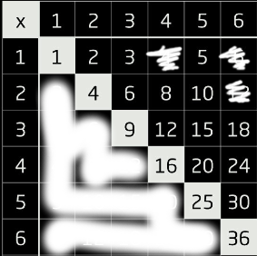
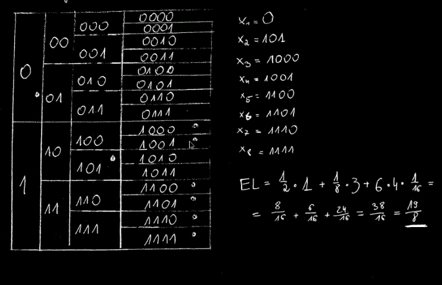

# Lista 1

- [Zadanie 1](#zadanie-1)
    - [1.a)](#1a)
    - [1.b)](#1b)
- [Zadanie 2](#zadanie-2)
    - [2.a)](#2a)
    - [2.b)](#2b)
- [Zadanie 3](#zadanie-3)
- [Zadanie 4](#zadanie-4)
- [Zadanie 5](#zadanie-5)
- [Zadanie 6](#zadanie-6)
- [Zadanie 8](#zadanie-8)

---

## Zadanie 1

> Oblicz entropię wyniku w następujących eksperymentach

### 1.a)

>  Rzucamy dwiema kostkami sześciennymi i sumujemy liczbę oczek.

$|\Omega| = 11$

$\Omega = \{ 2, 3, \dots, 12 \}$

$$
P(\omega) =
\begin{cases}
    2, 3, 11, 12 & \frac{1}{36}\\
    4, 5, 9, 10 & \frac{2}{36}\\
    6, 7, 8 & \frac{3}{36}\\
\end{cases}
$$

$\mathrm{H}(\Omega) = \mathrm{E}I$

$I(\omega) = -\log_2\left(P(\omega)\right)$

$\mathrm{E}I = \sum_{\omega \in \Omega} (P(\omega) \cdot \log_2(\frac{1}{P(\omega)})) = 4 \cdot \frac{1}{36} \cdot \log_2(36) + 4 \cdot \frac{2}{36} \cdot \log_2(18) + 3 \cdot \frac{3}{36} \cdot \log_2(12) = \frac{1}{36}( \log_2(36^4 \cdot 18^4 \cdot 12^3) ) = \dots$

---

### 1.b)

> Rzucamy dwiema kostkami sześciennymi i mnożymy liczbę oczek.

$\Omega = \{ x\cdot y: x,y \in \{1,\dots,6\}\}$

alternatywnie $\Omega = \{ x\in \{1,\dots, 36\}: x = a\cdot b \land a,b \in \{1,2,\dots,6\} \}$

$|\Omega| = 18$

$$
P(\omega) =
\begin{cases}
    1 & \frac{1}{36}\\
    2, 3 & \frac{2}{36}\\
    & \frac{3}{36}\\
\end{cases}
$$

$\mathrm{E}I = \sum_{\omega \in \Omega}(P(\omega) \cdot \log_2(\frac{1}{P(\omega)}) = 3\cdot \frac{2}{21} \cdot \log_2(\frac{21}{2}) + 15\cdot \frac{1}{21} \cdot \log_2(21) =\dots$

---

## Zadanie 2

>  Oblicz entropię wyniku w następujących eksperymentach

### 2.a)

> Rzucamy $n$ razy symetryczną monetą i liczymy liczbę orłów.

$|\Omega| = n+1$

$\Omega = \{ 0, \dots, n \}$

$$
P(\omega) =
\begin{cases}
    0 & \frac{1}{2^n}\\
    1 & \frac{n}{2^n}\\
    2 & \frac{\binom{n}{2}}{2^n}\\
    \dots\\
    \lfloor \frac{n}{2} \rfloor & \frac{\binom{n}{\lfloor \frac{n}{2} \rfloor}}{2^n}\\
    \dots\\
    n-2 & \frac{\binom{n}{n-2}}{2^n}\\
    n-1 & \frac{n}{2^n}\\
    n & \frac{1}{2^n}
\end{cases}
$$

$$
\mathrm{E}I = \sum_{i=0}^{n}(P(\omega) \cdot \log_2(\frac{1}{P(\omega)}) =\\
=
\frac{1}{2^n}\left(\begin{cases}
    \sum_{i=0}^{\frac{n}{2}} \binom{n}{i} \cdot \log_2\left(\frac{2^n}{\binom{n}{i}}\right) & \text{gdy } n \text{ jest parzyste}\\
    \sum_{i=0}^{\frac{n+1}{2}} \binom{n}{i} \cdot \log_2\left(\frac{2^n}{\binom{n}{i}}\right) & \text{gdy } n \text{ jest nieparzyste}
\end{cases}\right) = (*)
$$

$$
(*) =
\frac{1}{2^n} \cdot \sum_{i=0}^{k} \binom{n}{i} \cdot \left(n - \log_2\left(\binom{n}{i}\right)\right)
$$

---

### 2.b)

> Rzucamy symetryczną monetą do uzyskania pierwszego orła. Wynikiem jest liczba wykonanych rzutów.

$H(X) = \frac{1}{2}\log_2(2) + \frac{1}{4}\log_2(4) + \dots = \sum_{i=1}^{\infty}\frac{1}{2^i}\log_2 2^i = \sum_{i=1}^{\infty}i\frac{1}{2^i} = \sum_{i=1}^{\infty} \frac{1}{2^i} + \sum_{i=2}^{\infty} + \dotsb = \frac{\frac{1}{2}}{1 - \frac{1}{2}} + \frac{\frac{1}{4}}{1 - \frac{1}{2}} + \dotsb = 1 + \frac{1}{2} + \frac{1}{4} + \dots = \sum_{i=0}^{\infty}\frac{1}{2^i} = \frac{1}{1-\frac{1}{2}} = 2$

---

## Zadanie 3

>  Niech X będzie dyskretną zmienną losową. Jaka będzie zależność między entropią X a entropią Y jeśli:
>
> a) $Y = X + 4$\
> b) $Y = 2^X$\
> c) $Y = X^2$\
> d) $Y = \sin X$

Niech $y = g(x)$, wówczas:
$$
P(y) = \sum_{x:~ y=g(x)} P(x)
$$

$$
\sum_{x:~ y=g(x)}P(x) \log_2P(x) \le \sum_{x:~ y=g(x)}P(x) \log_2 P(y) = P(y) \log_2 P(y)
$$

$$
H(X) = -\sum_{x} P(x)\log_2P(x) = -\sum_{y}\sum_{x: y=g(x)} P(x) \log_2 P(x) \ge\\
\ge -\sum_{y} P(y) \log_2 P(y) = H(Y)
$$

---
a), b) $H(X) = H(Y)$\
c), d) $H(X) > H(Y)$

---

## Zadanie 4

> Jaka jest maksymalna entropia dyskretnej zmiennej losowej o $N$ wartościach. Podaj wszystkie możliwe rozkłady spełniające to maksimum.

$f(P(x_i) \lambda) \sum_{x_i \in X} \log\frac{1}{P(x_i)} P(x_i) + \lambda(1 - \sum_{x_i \in X}P(x_i))$

$1 = \sum P(x_i)$

$P(x_i) = \beta_i^2$

$\frac{\delta}{\delta} \frac{f(P(x_i), \lambda)}{\beta_i} = 2\beta_i \log\frac{1}{\beta_i^2} - 2\beta_i\frac{1}{\beta_i^2}\beta_i^2 + 2\lambda\beta_i = 0$

$2 \log\frac{1}{\beta_i} - 1 + \lambda = 0 \implies \log\frac{1}{\beta_i} = \frac{1 - \lambda}{2} = C$ ($\beta_i = 2^C = C$)

$\frac{\delta}{\delta} \frac{f(P(x_i), \lambda)}{\lambda} = 1 - \sum \beta_i^2 = 0 \implies 1 = N \cdot P(x_i) \implies P(x_i) = \frac{1}{N}$

---

## Zadanie 5

> Jaka jest minimalna entropia dyskretnej zmiennej losowej o $N$ wartościach. Podaj wszystkie możliwe rozkłady spełniające to minimum.

Hipoteza: Minimalna entropia zachodzi dla rozkładu, gdzie $(\exists i)(p_i = 1)$, gdyż wtedy mamy najwięcej wiedzy wejściowej.

D-d:

Weźmy zatem układ $(p_1, \dots, p_N)$, gdzie $p_i = 1 \land (\forall j \neq i)(p_j = 0)$

$H(X) = -\sum_{k=1}^{N} p_k \log_2 p_k = -p_i \log_2 p_i = -\log_2 (1) = 0$

Skoro entropia jest sumą po liczbach postaci $p \log_2 \frac{1}{p}$, gdzie $p \in [0;1]$ to wiemy, że ów iloczyn nie może przyjąć wartość ujemnej, bo $\log_2 \frac{1}{2} \ge 0$ oraz $p \ge 0$.

Zatem rozkład pokazany powyżej daje najmniejszą możliwą wartość entropii. Takich rozkładów jest $N$, gdyż możemy wybrać dowolny $x_i$ jako ten, którego $2(x_i) = 1$.

---

Jedyny taki rozkład, bo:

$H(X) = -\sum_{i=0}^{N} p_i \underbrace{\log_2 p_i}_{<0} > 0$,
$$
\begin{cases}
    (\exists i) (p_i > 0)\\
    (\forall i) (p_i \neq 1)\\
\end{cases}

\implies

(\exists j) (p_j \in (0;1))
$$

Logarytm dla $p_j \in (0;1)$ jest zawsze ujemny zatem suma będzie zawsze dodatnia, bo mnożymy przez $-1$.

---

## Zadanie 6

> Załóżmy, że mamy dwa źródła $X$ i $Y$ o entropiach $H(X)$ i $H(Y)$, takie że zbiory ich symboli są rozłączne. Przeprowadzamy losowanie i z prawdopodobieństwem p podajemy symbol ze źródła $X$, a z prawdopodobieństwem $1 − p$ ze źródła $Y$. Jaka jest entropia wyniku takiej procedury?

$H(Z) = -\sum_{s \in X} p\cdot q_{x_s} \cdot \log(pq_{x_s} - \sum_{x\in Y}(1-p)q_{y_s} \log((1-p) q_{y_s}) = -p\sum_{s \in X} q_{x_s}(\log p + \log q_{x_s}) - (1-p)\sum_{s \in Y}q_{y_s}(\log (1-p) + \log y_{y_s}) = -p\log p \sum_{s \in X} q_{x_s} - p\sum q_{x_s} \log q_{x_s} - (1-p) \sum q_{y_s} \log q_{y_s} - (1-p) \log(1-p) \sum_{x \in Y} q_{y_s} = -p\log p + p \cdot H(X) + (1-p) \cdot H(Y) - (1-p) \log(1-p) = H(P) + p\cdot H(X) + (1-p) \cdot H(Y)$

---

## Zadanie 8

> Dla rozkładu $P({x_1}) = \frac{1}{2}, P({x_2}) = \frac{1}{8}, P({x_3}) = P({x_4}) = \dots = P({x_8}) = \frac{1}{16}$ znajdź kody (prefiksowe), tak by średnia długość słowa kodowego była równa entropii.

- $X = \{x_1, \dots, x_8\}$
- $H(X) = \frac{1}{2} \log_2 (2) + \frac{1}{8} \log_2(8) + 6 \cdot \frac{1}{16} \log_2 (16) = \frac{1}{2} + \frac{3}{8} + \frac{6}{4} = \frac{19}{8} = 2,375$

$\mathrm{E}L$ musi wynosić $\frac{19}{8}$

*(kod prefixowy $\implies$ żadne ze słów kodujących nie jest prefixem innego)*

$\mathrm{E}L = \frac{1}{2} \cdot 1 + \frac{1}{8} \cdot 3 + 6 \cdot 4 \cdot \frac{1}{16} = \frac{8}{16} + \frac{6}{16} + \frac{24}{16} = \frac{38 }{16} = \frac{19}{8}$
