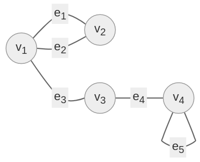
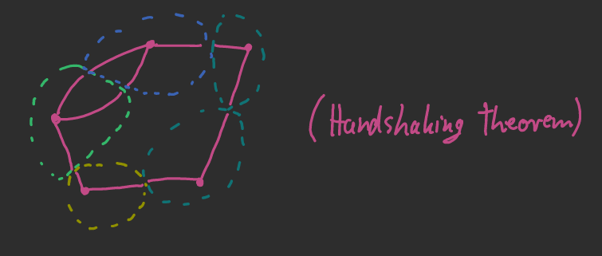
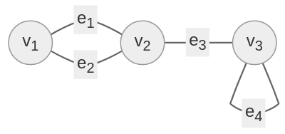
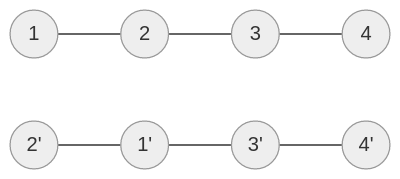

# Pojęcie grafu
*(2020-02-26)*

**Graf (multigraf)**

**Graf prosty (graf)**

## $Definicja$ graf

**Grafem** nazywamy $(V, E, \phi)$ gdzie
  - $\phi E \xrightarrow{1-1} [V]^{\le2} \setminus \{ \emptyset \}$
    - gdzie $[V]^{\le2} = \{ A \subseteq V: |A| \le 2 \}$
  - $V$ - vertices
  - $E$ - edges

### Przykład

$V = \{ v_1, v_2, v_3, v_4 \}$\
$E = \{ e_1, ..., e_5 \}$

$\phi(e_1) = \{ v_1, v_2 \}$\
$\phi(e_2) = \{ v_1, v_2 \}$\
$\phi(e_3) = \{ v_1, v_3 \}$\
$\phi(e_4) = \{ v_3, v_4 \}$\
$\phi(e_5) = \{ v_4 \}$

## $Definicja$ graf prosty

Graf $(V, E, \phi)$ jest **prosty**, jeśli $\phi: E \rightarrow [V]^{=2} \equiv (*)$\
$[V]^{=2} = \{ A \subseteq V: |A| = 2 \}$

Uwagi:
1. $(*) \equiv (V, E)$, gdzie $E \subseteq [V]^{2}$
2. Zał. że $(V, E)$ jest prosty $\land$ $|V| = n$
   - $0 \le |E| \le \binom{n}{2} = |[V]^{=2}| = \frac{n(n-1)}{2}$
3. Zał. że $V = \{ 1, ..., n \}$. Ile jest grafów prostych na $V$?
   - odp. $2^{\binom{n}{2}} = |P([1,...,n]^2)|$

### Przykład
$n = 10$\
$2^{\binom{n}{2}} = 2^{\frac{9*10}{2}} = 2^{45} \eqsim 10^{16}$

## Rząd (stopień wierzchołka)

$\deg(v) = 6$

$\deg(v) = 2$

$\deg(v) = 5$

$$
\llbracket \phi \rrbracket = \begin{cases}
  1: \phi \equiv True\\
  0: \phi \equiv False\\
\end{cases}
$$

graf $(V, E, \phi)$

$deg(v) = 2\sum_{e \in L} || \phi(e) = \{ v \} || + \sum_{e \in D}\llbracket v \in \phi(e) \rrbracket$\
$L = \{ e \in E: |\phi(e)| = 1 \}$\
$D = \{ e \in E: |\phi(e)| = 2 \}$

### Przykład

$\sum_{v \in V} = 2|E|$

## $Twierdzenie$ #1

Dla dowolnego grafu mamy $\sum_{v \in V}\deg(v) = 2|E|$

### Dowód

$$
\sum_{v \in V}\deg(v) = \sum_{v \in V}(2\sum_{e \in L}||\phi(e) = \{v\}|| + \sum_{e \in D}||v \in \phi(e)||) =
$$
$$
2\sum_{v \in V}\sum_{e\in L}||\phi(e) = \{v\}|| + \sum_{v \in V}\sum_{e \in D}||v \in \phi(e)|| =
$$
$$
2\sum_{e \in L}\sum_{v \in V}||\phi(e) = \{v\}|| + \sum_{e \in D}\sum_{v \in V}||v \in \phi(e)|| =
$$
$$
2\sum_{e \in L}1 + \sum_{e \in D}2 = 2|L| + 2|D| = 2(|L| + |D|) = 2|E|
$$
$\blacksquare$

## Macierzowe Reprezentacje

$V = \{ v_1, v_2, ..., v_n \}$\
$E = \{ e_1, e_2, ..., e_m \}$

### Macierz sąsiędztwa
$M = [a_{ij}]$
$$
a_{ij} = \begin{cases}
  \left|\{ e \in L: \phi(e) = \{ v_i, v_j \} \}\right|: i \neq j\\
  2\left|\{e \in E \}\right|
\end{cases}
$$

### Macierz incydencji
$$
N = [b_{ij}]_{i = 1...n,~j = 1...m}
$$
$$
b_{ij} = \begin{cases}
  1: \phi(e_j) \ni v_i \land |\phi(e_j)| = 2\\
  2: \phi(e_j) = \{ v_i \}
\end{cases}
$$

### Przykład

$$
N =
\begin{array}{c}
\begin{matrix}
\\
v_1 \\
v_2 \\
v_3 \\
\downarrow
\end{matrix}
\begin{array}{r}
\begin{matrix}
e_1 & e_2 & e_3 & e_4~~
\end{matrix} \\
\begin{Bmatrix}
  ~1 & ~1 & ~0 & ~0\\
  ~1 & ~1 & ~1 & ~0\\
  ~0 & ~0 & ~1 & ~2\\
  ~2 & ~2 & ~2 & ~2
\end{Bmatrix}
\end{array}
\begin{matrix}
\\
\deg(v_1) \\
\deg(v_2) \\
\deg(v_3) \\
\sum
\end{matrix}
\end{array}
$$

**Wniosek:** $|\{ v \in V: \neg \left(2\lvert\deg\left(v\right)\right) \}|$ jest parzysta

## $Twierdzenie$ #2

Zał. że $(V, E)$ jest grafem prostym,\
wówczas $\sum_{\{x,y\} \in E}(\deg(x) + \deg(y)) = \sum_{x \in V}\deg^2(x)$

### Dowód

$$
\sum_{\{x,y\} \in E}( \deg(x) + \deg(y) ) = \frac{1}{2}\sum_{\{x,y\} \in V} \llbracket\{x,y\} \in E\rrbracket\Big( \deg(x) + \deg(y) \Big)=
$$
$$
= \frac{1}{2}\bigg( \sum_{x \in V} \sum_{y \in V}\Big( \llbracket \{x,y\} \in E\rrbracket \deg(x) ) + \sum_{x \in V} \sum_{y \in V} \Big( \llbracket \{x,y\} \in E \rrbracket \deg(y) \Big) \bigg) =
$$
$$
= \frac{1}{2}\bigg( \sum_x\deg(x)\Big( \sum_y \llbracket\{x,y\} \in E\rrbracket \Big) + \sum_y\deg(y) \Big( \sum_x\llbracket\{x,y\} \in E\rrbracket \Big) \bigg) =
$$
$$
= \frac{1}{2}\bigg( \sum_x\deg^2(x) + \sum_y\deg^2(y) \bigg)
$$
$\blacksquare$

## $\phi$ jest izomorfizmem...
...grafów prostych $(V_1, E_1)$ oraz $(V_2, E_2)$ jeśli:
1. $\phi:V_1 \xrightarrow[na]{1-1}V_2$
2. $(\forall{x,y \in V_1})( \{x,y\} \in E \iff \{\phi(x_1), \phi(x_2)\} \in E_2 )$

### Przykład

### Przykład

*Ile jest nieizomorficznych grafów prostych na $\{1,...,n\}$*

odp.: $L_n \sim \frac{2^{\small\binom{n}{2}}}{n!}$

### Przykład

## $Definicja$ Wektor rzędów

Niech $(V, E)$ będzie grafem prostym $V=\{v_1...v_n\}$

Wektor rzędów: $sort(( \deg(v_1), \deg(v_2), ..., \deg(v_n) ))$

### Przykład

$(2,4,1,3,2) \leftarrowtail (4,3,2,2,1)$

Uwagi
1. $(d_1, ..., d_n)$ - wektor rzędu
   1. $d_1 \ge d_2 \ge ... \ge d_n$
   2. $d_1 \le n-1$
2. $(V_1, E_1) \underset{IZO}{\cong} (V_2, E_2) \implies$ mają te same wektory rzędów

## $Definicja$ Graficzność ciągu

Ciąg $(d_1...d_n)$ jest graficzny, jeśli istnieje graf prosty $(V,E)$ o tym rzędzie

## $Twierdzenie$ *Havel-Hakiri*

Ciąg $g = (g_1...g_n)$ jest graficzny $\iff$ gdy ciąg $(g_2'...g_n')$ jest graficzny, gdzie
$$
g_i =
\begin{cases}
  g_i - 1: i = 2...g_1+1\\
  g_i: i = g_1 + 2,...n
\end{cases}
$$

### Przykład

$(3,3,3,2,2)$ - graf\
$\equiv$\
$(2,2,1,2)$ - graf\
$\equiv$\
$(2,2,2,1)$ - graf\
$\equiv$\
$(1,1,1)$ - graf\
$\equiv$\
$(0,1)$ - graf\
$\equiv$\
$(1,0)$\
$\equiv$\
$(-1)$

