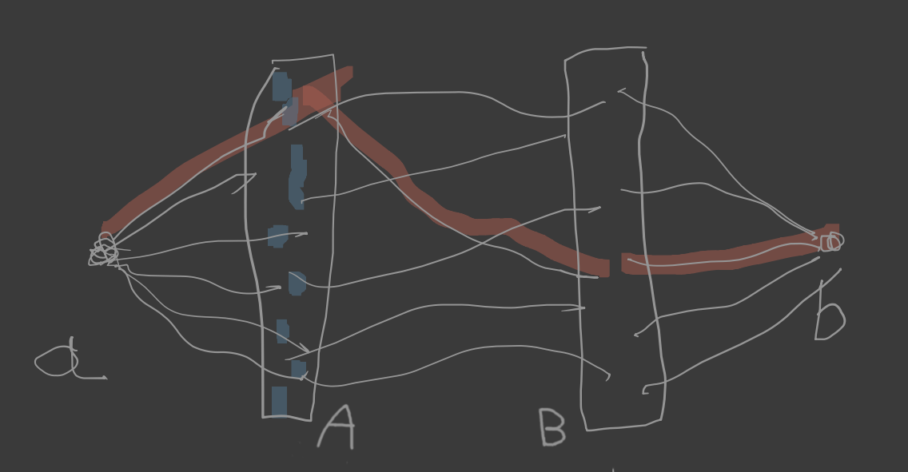

# Twierdzenie Mengera II
*(2020-04-29)*

**Twierdzenia Mengera są prawdziwe dla dowolnego grafu!**

## $\text {Def}$ Pełne skojarzenie

Pełnym skojarzeniem (z $C$ do $D$) w grafie dwudzielnym $G = G(D,C)$ nazywamy dowolną różnowartościową funkcję $f: D \to C$ taką, że $(\forall x\in D)(\{x, f(x)\} \in E(G))$.

## $\text {Def}$ Sąsiedztwo w grafie dwudzielnym
Niech $G = G(D,C)$ będzie grafem dwudzielnym. Dla $X\subseteq D$ określamy
$$
\mathcal{N}(X) = \{y\in C: (\exists x \in X)(\{x,y\} \in E(G))\}
$$

## Prosta obserwacja #1
Jeśli istnieje [pełne skojarzenie](#text-def-pe%c5%82ne-skojarzenie) w grafie dwudzielnym $G = G(D,C)$, to dla dowolnego $X \subseteq D$ mamy $|X| \le |\mathcal{N}(X)|$.

## $\text {Twierdzenie}$ Halla (o małżeństwach)

Niech $G = G(A,B)$ będzie grafem dwudzielnym.\
$\circlearrowright$:
1. Istnieje pełne skojarzenie w grafie $G$ z $A$ do $B$
2. $(\forall X \subseteq A)(|X| \le |\mathcal{N}(X)|)$

### D-d $\text {Twierdzenia}$ Halla (o małżeństwach)

Wiemy już, że $(1) \implies (2)$. Zajmijmy się odwrotną implikacją.

Załóżmy więc, że $(2)$ jest prawdziwa. Rozważamy następujący graf $G'$: jego wierzchołkami są zbiory $A\cup B\cup \{a,b\}$ ($a$ i $b$ są jakimiś elementami nie należącymi do $A \cup B$); jego krawędziami jest zbiór
$$
E(G) \cup \big\{ \{a,x\}: x\in A \big\} \cup \big\{ \{y,b\}: y \in B \big\}.
$$

Claim: **każdy $(a,b)$–separator w grafie $G'$ ma moc $\ge |A|$**

Niech $X$ będzie $(a,b)$–separatorem.\
Wówczas:
$$
|A| = |A \cap X| + |A \setminus X| \le |A \cap X| + |\mathcal{N}(A\setminus X)|\\
\le |A\cap X| + |B\cap X| = |X|.
$$
Zbiór $A$ jest $(a,b)$–separatorem. Zatem najmniejsza moc separatora to $|A|$. Na mocy twierdzenia Mengera istnieje zbiór wewnętrznie rozłącznych $(a,b)$–ścieżek mocy $|A|$. Z tego zbioru otrzymujemy pełne skojarzenie.

## $\text {Def}$ Skojarzenie

Skojarzeniem w grafie $G$ nazywamy dowolny zbiór krawędzi $\mathcal{E}\subseteq E(G)$ taki, że $(\forall e,f \in \mathcal{E})(e\neq f\implies e\cap f =\emptyset)$.

## $\text {Def}$ #4
$\nu(G) = \max\{|\mathcal{E}|: \mathcal{E}\text{ jest skojarzeniem w } G\}$

## $\text {Def}$ Pokrycie wierzchołkowe

Pokryciem wierzchołkowym grafu $G$ nazywamy dowolny zbiór wierzchołków $A\subseteq V(G)$ taki, że $(\forall e\in E(G))(e \cap A\neq\emptyset)$.

## $\text {Def}$ #6
$\tau(G) = \min\{|A|: A\text{ jest pokryciem wierzchołkowym } G$

## $\text {Fakt}$ #1
$\nu(G) \le \tau(G) \le 2\nu(G)$

### D-d $\text {Fakt}$u #1
Niech $\mathcal{E}$ będzie dowolnym [skojarzeniem](#text-def-skojarzenie) zaś $A$ dowolnym [pokryciem](#text-def-pokrycie-wierzcho%c5%82kowe). Wówczas dla każdej krawędzi $e \in \mathcal{E}$ istnieje $a_e \in A\cap e$. Z rozłączności krawędzi ze skojarzenia wynika, że odwzorowanie $e\to a_e$ jest różnowartościowe.\
Zatem $|\mathcal{E} \le |A|$. To dowodzi pierwszej nierówności.

Rozważmy teraz skojarzenie $\mathcal{E}$ o największej mocy. Niech $A = \bigcup\mathcal{E}$. Wówczas $|A| = 2\nu(G)$. Ponadto $A$ jest pokryciem, bo dla dowolnej krawędzi $e$ mamy $e\cap A \neq \emptyset$ (to wynika z maksymalności $\mathcal{E}$).\
A to pokazuje drugą nierówność.

## $\text {Twierdzenie}$ Königa (o grafie dwudzielnym).
Jeśli $G$ jest grafem dwudzielnym, to $\nu(G) = \tau(G)$.

### D-d $\text {Twierdzenia}$ Königa (o grafie dwudzielnym)
Niech $G = G(X,Y)$. Zastosujemy [twierdzenie Mengera](../2020-04-22/twierdzenie-mengera.md#text-twierdzenie-mengera-wersja-wierzcho%c5%82kowa) do zbiorów $A = X$ i $B = Y$.\
Każde [skojarzenie](#text-def-skojarzenie) w $G$ definiuje rodzinę parami rozłącznych $(A,B)$–ścieżek. I odwrotnie: każda rodzina parami rozłącznych $(A,B)$–ścieżek generuje skojarzenie.

Bierzemy zbiór $\mathcal{P}$ wierzchołkowo rozłącznych $(A,B)$–ścieżek największej mocy, którą oznaczamy przez $k$. Z twierdzenia Mengera wynika istnienie $(A,B)$–separatora mocy $k$. Każdy separator przecina każdą krawędź.\
Istnieje więc pokrycie wierzchołkowe mocy $k$.

## $\text {Def}$ #7
Niech $\mathcal{X} = (X,\preceq)$ będzie częściowym porządkiem.
1. Podzbiór $L\subseteq X$ nazywamy łańcuchem w $\mathcal{X}$ jeśli $(\forall x,y \in L)(x\preceq y\lor x=y \lor y\preceq x)$
2. Podzbiór $A\subseteq X$ nazywamy antyłańcuchem w $\mathcal{X}$ jeśli $(\forall x,y \in A)(x\neq y \implies (\neg(x\preceq y)\land \neg(y\preceq x)))$

## $\text {Fakt}$ #2
Jeśli $L$ jest łańcuchem oraz $A$ jest antyłańcuchem, to $|A\cap L| \le 1$.

## Wniosek #1
Jeśli $\mathcal{L}$ jest rozbiciem $X$ na łańcuchy i $A$ jest antyłańcuchem, to $|A| \le |\mathcal{L}|$

## $\text {Twierdzenie}$ Dilwortha (o dekompozycji)

Dla dowolnego skończonego częściowego porządku $\mathcal{X} = (X,\preceq)$ następujące dwie liczby są równe:
1. $\min\{|\mathcal{L}|: \mathcal{L}\text{ jest rozbiciem }X\text{ na łańcuchy}\}$
2. $\max\{|A|: A\text{ jest antyłańcuchem w }\mathcal{X}\}$

### D-d $\text {Twierdzenia}$ Dilwortha (o dekompozycji)
Niech $\mathcal{X} = (X,\preceq)$ będzie częściowym porządkiem. Definiujemy graf $G(V,E)$:\
$V = \{x^-:x\in X\}\cup\{x^+:x\in X\}$\
$E = \big\{\{x^+,y^+\}: x\prec y\big\}$

To jest graf dwudzielny. Znajdujemy skojarzenie $M$ największej mocy $k$ (krawędzie czerwone, druga część rysunku, tutaj $k=3$). Powracamy do wyjściowego częściowego porządku (trzecia część rysunku). Otrzymujemy rozbicie $\mathcal{L}$ na zbiorze $X$ na łańcuchy. Niech $C$ będzie zbiorem najmniejszych elementów w tych łańcuchach.\
Wówczas $|X \setminus C| = |M|$ oraz, oczywiście, $|C| = |\mathcal{L}|$.\
Zatem $|\mathcal{L}| = |X| - |M| = |X| - k$.

Na mocy [twierdzenia Königa](#text-twierdzenie-k%c3%b6niga-o-grafie-dwudzielnym) mamy [pokrycie wierzchołkowe](#text-def-pokrycie-wierzcho%c5%82kowe) $A$ grafu $G$ mocy $k$.\
Niech $B = \{x\in X: x^+\in A\lor x^-\in A\}$. Wówczas $|B| \le |A| = k$.

Claim: $X\setminus B$ jest antyłańcuchem.\
Załóżmy, że $x,y\in X\setminus B$ oraz $x\neq y$. Gdyby $x\prec y$, to $\{x^+,y^-\}\in E$, więc $\{x^+,y^-\}\cap A \neq \emptyset$, więc $x \in B \lor y \in B$. Podobnie, nie jest możliwe aby $y\prec x$

Zbiór $C = X\setminus B$ jest więc antyłańcuchem w $\mathcal{X}$, oraz
$$
|C| = |X\setminus B| = |X| - |B| \ge |X| - k.
$$
Zatem istnieją rozbicie $\mathcal{L}$ na łańcuchy oraz antyłańcuch $C$ takie, że $|C|\ge|\mathcal{L}|$, co kończy dowód.
